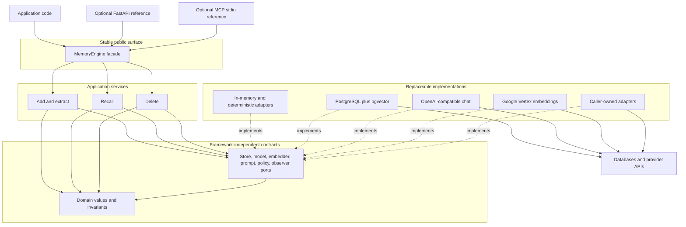

# Architecture

Portable Memory Engine is an in-process library with dependency-inverted
boundaries. Application code selects every external resource; the package does
not discover providers, credentials, databases, or transports at import time.

## System map

Solid arrows inside the package show source-code dependencies. Adapter-to-port
arrows mean that an adapter implements a port; core code never imports the
adapter. Optional integrations depend on the stable facade and do not become a
second application layer.

## Layer responsibilities

| Layer | Owns | Must not own |
|---|---|---|
| Domain | Scope, memory values, typed commands, invariants, public errors | HTTP, ORM, provider SDK, configuration loading |
| Ports | Provider-neutral behavior and capability declarations | Native client, session, response, or exception types |
| Application | Add, recall, delete orchestration; policy and lifecycle calls | Database schema, transport status codes, credential discovery |
| Public facade | Explicit composition and shared resource lifecycle | Automatic adapter selection or global state |
| Adapters | Native API translation, resource clients, sanitized failures | Cross-provider business policy or relaxed scope checks |
| Optional integrations | Transport-only schemas, mapping, and local examples | Core behavior, production authentication, implicit caller identity |

The import contract is checked automatically: domain, ports, and application
dependencies point inward. The package root exports a curated facade and common
values; specialized adapters and integrations remain explicit imports.

## Runtime paths

### Add

1. The caller supplies a complete scope, messages, event time, requested kinds,
   and an idempotency key.
2. Access policy and adapter capabilities are checked before model work.
3. The configured prompt and chat adapters produce untrusted output.
4. Strict parsers convert that output into bounded candidate operations.
5. Identity, freshness, and expected-version rules are applied.
6. The store atomically enforces idempotency, freshness, and compare-and-swap.
7. The caller receives structured per-kind results, including partial failure.

### Recall

1. The caller supplies a complete scope and optional store-side filters.
2. Recency recall queries the store directly. Semantic recall embeds a bounded
   query and requires vector-search capability.
3. The selector returns a stable page; an optional reranker can reorder only
   that already bounded page.
4. Unsupported semantic behavior fails explicitly and never becomes recency.

### Delete

1. A typed command selects memory, scope, subject, or session contribution.
2. Policy and target-specific capabilities are checked.
3. The store deletes or tombstones according to the public kind policy and
   advances a content-free event-time barrier atomically.
4. A structured count result describes what was matched and removed.

## Isolation and trust boundaries

`MemoryScope` is present at every ordinary read, write, search, and delete
boundary. Subject deletion is the only cross-namespace operation and uses an
explicit `MemorySubject`. A memory ID, source, session ID, transport client, or
provider identity never replaces scope.

Model output, provider responses, database failures, HTTP requests, and MCP tool
arguments are untrusted boundary inputs. Adapters and integrations validate and
map them before core use. Native exceptions and payloads do not become public
errors or default observer fields.

## Lifecycle and concurrency

The facade is an async context manager. With default ownership it opens each
distinct injected resource once, then closes resources in reverse order after
active operations finish. Shared resources require explicit
`owns_resources=False` and caller-managed cleanup.

Correctness does not depend on a process-local lock alone. Stores declare and
enforce atomic idempotency, compare-and-swap, freshness watermark, deletion
barrier, and transaction capabilities. Missing capabilities fail before a
semantic downgrade can occur.

## Extension rules

- Add a provider or database by implementing a port and translating native
  errors to sanitized public errors.
- Run the shared store contract for every declared storage capability.
- Keep wire schemas, database rows, and provider objects out of domain values.
- Add a public-facade option only when callers need the behavior across
  implementations; keep provider-specific tuning in the adapter.
- Treat changes to scope, identity, freshness, deletion, or root exports as
  compatibility changes requiring an ADR and migration note.

See [concepts](concepts.md), [adapter selection](adapters.md), and the
[layering decision](adr/0001-layered-architecture.md) for the normative details.
